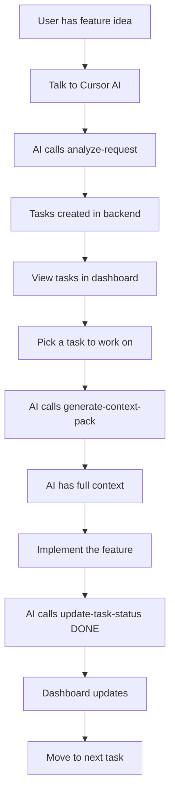

# 🎯 Cursor IDE + MCP Integration Guide

## Complete Guide to Using Vibecoding with Cursor AI

---

## 📋 Table of Contents
1. [Setup in Cursor](#setup-in-cursor)
2. [The 4 MCP Tools](#the-4-mcp-tools)
3. [Practical Examples](#practical-examples)
4. [Complete Workflows](#complete-workflows)
5. [Troubleshooting](#troubleshooting)

---

## 🔧 Setup in Cursor

### Prerequisites
✅ Cursor IDE installed  
✅ Vibecoding services running (all 3: backend, frontend, MCP server)  
✅ MCP Server accessible at http://localhost:4001

### Configuration Steps

#### Option 1: Settings UI (Recommended)

1. **Open Cursor Settings**
   ```
   Windows/Linux: Ctrl + ,
   Mac: Cmd + ,
   ```

2. **Search for "MCP"** in the settings search bar

3. **Click "Edit in settings.json"** under MCP Servers section

4. **Add this configuration:**
   ```json
   {
     "mcpServers": {
       "vibecoding": {
         "url": "http://localhost:4001",
         "description": "Vibecoding Project Manager - Task & workflow management"
       }
     }
   }
   ```

5. **Save** (Ctrl+S / Cmd+S)

6. **Restart Cursor IDE**

#### Option 2: Direct JSON Edit

1. **Open Command Palette**
   ```
   Windows/Linux: Ctrl + Shift + P
   Mac: Cmd + Shift + P
   ```

2. **Type:** `Preferences: Open User Settings (JSON)`

3. **Add the MCP configuration** (same as above)

4. **Save and Restart Cursor**

### Verify Connection

After restarting Cursor:

1. Open **Cursor Chat** (Ctrl+L / Cmd+L)
2. Type `@` and look for MCP tools
3. Or check the **MCP panel** in sidebar
4. You should see 4 tools available:
   - `analyze-request`
   - `generate-context-pack`
   - `spawn-sub-orchestrator`
   - `update-task-status`

---

## 🛠️ The 4 MCP Tools

### Tool 1: `analyze-request` 🎯

**Purpose:** Breaks down a natural language feature request into discrete tasks and creates them automatically.

**When to use:**
- Starting a new feature
- Planning complex functionality
- Breaking down user stories
- Initial project setup

**Input Schema:**
```json
{
  "projectId": "string (required)",
  "request": "string (required) - Your feature description"
}
```

**Example Usage in Cursor:**

```
You: I need to add dark mode to my e-commerce app

Cursor AI: Let me analyze this request and create tasks.
[AI calls analyze-request tool]

Tool Input:
{
  "projectId": "487876d0-dcad-47e8-a897-0cb61de073c2",
  "request": "Add dark mode to the entire application with a toggle button in the settings menu that persists the user's preference"
}

Tool Output:
✓ Created 5 tasks:
  1. [T-abc123] Create dark mode color scheme (@frontend)
  2. [T-abc124] Build theme toggle component (@frontend)
  3. [T-abc125] Add theme persistence to localStorage (@frontend)
  4. [T-abc126] Update all components for theme support (@frontend)
  5. [T-abc127] Add theme context provider (@frontend)

You can now see these tasks in your Kanban board at http://localhost:3000
```

**What it does:**
1. Analyzes your request using AI
2. Breaks it into logical tasks
3. Assigns appropriate agents
4. Creates tasks in the backend
5. Returns task IDs for reference

---

### Tool 2: `generate-context-pack` 📦

**Purpose:** Assembles all relevant context for working on a specific task.

**When to use:**
- Before starting work on a task
- When an agent needs focused context
- Switching between different tasks
- Onboarding new AI agents to a task

**Input Schema:**
```json
{
  "projectId": "string (required)",
  "taskId": "string (required)",
  "agentType": "string (optional) - e.g., '@frontend'"
}
```

**Example Usage in Cursor:**

```
You: I'm ready to work on task T-b769fbdd

Cursor AI: Let me get the context for that task.
[AI calls generate-context-pack tool]

Tool Input:
{
  "projectId": "487876d0-dcad-47e8-a897-0cb61de073c2",
  "taskId": "T-b769fbdd",
  "agentType": "@frontend"
}

Tool Output:
📦 Context Pack for Task T-b769fbdd

PROJECT: E-Commerce Store
DESCRIPTION: Full-stack e-commerce platform with product catalog, 
shopping cart, checkout, and admin dashboard

TASK: Build product catalog UI
DESCRIPTION: Create product listing page with filters and search
STATUS: READY
ASSIGNED TO: @frontend

TECH STACK:
- Frontend: React + Redux
- Backend: Express + Stripe
- Database: PostgreSQL

RELATED TASKS:
- T-b95f1107: Implement shopping cart (IN_PROGRESS)
- T-e4b1e2c0: Design database schema (READY)

KNOWLEDGE FILES:
- PROJECT_MAP.md: [Architecture overview...]
- COMPONENT_SUMMARIES.md: [Existing components...]
- FILE_DEPENDENCIES.md: [Import relationships...]

You can now start implementing with full project context!
```

**What it does:**
1. Fetches project details
2. Gets specific task information
3. Retrieves related tasks
4. Loads project knowledge files
5. Tailors context for agent type
6. Returns comprehensive work package

---

### Tool 3: `spawn-sub-orchestrator` 🤖

**Purpose:** Creates a project-specific system prompt for spawning a new AI instance dedicated to this project.

**When to use:**
- Starting complex multi-step work
- Need a dedicated AI for a project
- Want an AI with full project context
- Managing large projects
- Running parallel work streams

**Input Schema:**
```json
{
  "projectId": "string (required)"
}
```

**Example Usage in Cursor:**

```
You: I need a dedicated AI for the e-commerce project

Cursor AI: I'll create a sub-orchestrator with full project context.
[AI calls spawn-sub-orchestrator tool]

Tool Input:
{
  "projectId": "487876d0-dcad-47e8-a897-0cb61de073c2"
}

Tool Output:
🤖 Sub-Orchestrator System Prompt Generated

You are a Sub-Orchestrator for the "E-Commerce Store" project.

PROJECT OVERVIEW:
Full-stack e-commerce platform with product catalog, shopping cart, 
checkout, and admin dashboard

TECH STACK:
- Frontend: React + Redux
- Backend: Express + Stripe  
- Database: PostgreSQL

YOUR ROLE:
You manage all tasks and coordinate development for this project.
You have access to all project knowledge and can delegate to specialized agents.

CURRENT TASKS:
- [READY] Build product catalog UI (@frontend)
- [READY] Design database schema (@backend)
- [IN_PROGRESS] Implement shopping cart (@frontend)
- [DONE] Setup authentication (@backend)

KNOWLEDGE BASE:
[Full project documentation loaded]

USE THIS PROMPT IN A NEW CURSOR TAB/WINDOW FOR A DEDICATED PROJECT AI
```

**What it does:**
1. Loads complete project information
2. Retrieves all tasks and their states
3. Fetches all knowledge files
4. Generates comprehensive system prompt
5. Returns ready-to-use prompt for new AI instance

**How to use the output:**
1. Copy the generated prompt
2. Open a **new Cursor tab** or **Composer**
3. Paste the system prompt
4. You now have a dedicated AI for this project!

---

### Tool 4: `update-task-status` ✅

**Purpose:** Updates a task's workflow status programmatically.

**When to use:**
- Mark task as started (READY → IN_PROGRESS)
- Mark task as complete (IN_PROGRESS → DONE)
- Flag task as blocked (any → BLOCKED)
- Automate workflow updates
- Agent handoffs

**Input Schema:**
```json
{
  "taskId": "string (required)",
  "newStatus": "enum (required) - READY | IN_PROGRESS | DONE | BLOCKED",
  "projectId": "string (optional)"
}
```

**Example Usage in Cursor:**

```
You: I finished implementing the shopping cart

Cursor AI: Great! Let me mark that task as complete.
[AI calls update-task-status tool]

Tool Input:
{
  "taskId": "T-b95f1107",
  "newStatus": "DONE"
}

Tool Output:
✅ Task Updated Successfully

Task ID: T-b95f1107
Title: Implement shopping cart
Old Status: IN_PROGRESS → New Status: DONE
Assigned To: @frontend

The dashboard has been updated. Check http://localhost:3000 to see the change!
```

**What it does:**
1. Validates task exists
2. Updates status in database
3. Triggers UI refresh
4. Returns confirmation

---

## 🎬 Practical Examples

### Example 1: Complete Feature Implementation

**Scenario:** Add user authentication to your app

```
🗣️ You: I need to add user authentication with email/password login, 
registration, password reset, and JWT tokens

🤖 Cursor AI: Let me break this down into tasks.
[Calls analyze-request]

Tool: analyze-request
Input: {
  "projectId": "487876d0-dcad-47e8-a897-0cb61de073c2",
  "request": "Add user authentication with email/password login, registration, 
  password reset, and JWT tokens"
}

Output: Created 6 tasks:
✓ T-111111 - Design user database schema (@backend)
✓ T-222222 - Implement JWT token generation (@backend)
✓ T-333333 - Create login endpoint (@backend)
✓ T-444444 - Create registration endpoint (@backend)
✓ T-555555 - Build login UI component (@frontend)
✓ T-666666 - Build registration form (@frontend)

---

🗣️ You: Let me start with the backend login endpoint

🤖 Cursor AI: I'll get the context for that task.
[Calls generate-context-pack]

Tool: generate-context-pack
Input: {
  "projectId": "487876d0-dcad-47e8-a897-0cb61de073c2",
  "taskId": "T-333333",
  "agentType": "@backend"
}

Output: [Full project context + task details + related files]

---

[AI helps you implement the login endpoint]

---

🤖 Cursor AI: Done! Let me mark this task as complete.
[Calls update-task-status]

Tool: update-task-status
Input: {
  "taskId": "T-333333",
  "newStatus": "DONE"
}

Output: ✅ Task marked as DONE
```

---

### Example 2: Spawning Specialized Agents

**Scenario:** Complex project needs dedicated frontend and backend AIs

```
🗣️ You: This project is getting complex. I need dedicated agents for 
frontend and backend work.

🤖 Cursor AI: I'll create a sub-orchestrator prompt for this project.
[Calls spawn-sub-orchestrator]

Tool: spawn-sub-orchestrator
Input: {
  "projectId": "487876d0-dcad-47e8-a897-0cb61de073c2"
}

Output: [Full system prompt with project context]

---

🗣️ You: [Opens new Cursor tab, pastes the system prompt]

🤖 New Sub-Orchestrator AI: I'm ready! I have full context for the 
E-Commerce Store project. I see 8 tasks across frontend and backend. 
What would you like me to work on first?

🗣️ You: Start with the frontend tasks

🤖 Sub-Orchestrator: I'll delegate to the @frontend agent...
[Gets context using generate-context-pack]
[Works on frontend tasks]
[Updates status using update-task-status]
```

---

### Example 3: Workflow Automation

**Scenario:** Automate task progression through AI

```
🗣️ You: Review all READY tasks for the e-commerce project and start 
working on them in priority order

🤖 Cursor AI: Let me check the project status.
[Queries API to get all READY tasks]

Found 3 READY tasks:
1. T-b769fbdd - Build product catalog UI
2. T-e4b1e2c0 - Design database schema
3. T-abc123 - Add payment integration

Starting with highest priority: Build product catalog UI

[Calls update-task-status to mark as IN_PROGRESS]
[Calls generate-context-pack to get full context]
[Implements the feature]
[Calls update-task-status to mark as DONE]

Moving to next task: Design database schema...
```

---

## 🎯 Complete Workflows

### Workflow 1: From Idea to Implementation



**Real Conversation:**
```
You: "Add dark mode to my app"
AI: [analyze-request] → Creates 5 tasks
You: "Let's do the theme toggle first"
AI: [generate-context-pack] → Gets context
AI: [Implements theme toggle component]
AI: [update-task-status] → Marks as DONE
You: "Great! Next task?"
AI: "Next is implementing the color scheme..."
```

---

### Workflow 2: Multi-Agent Coordination

```
Main Orchestrator (in main Cursor tab)
  ↓
  ├─→ Frontend Sub-Orchestrator (new tab with spawn prompt)
  │   └─→ Works on @frontend tasks
  │       └─→ Updates status when done
  │
  └─→ Backend Sub-Orchestrator (another new tab)
      └─→ Works on @backend tasks
          └─→ Updates status when done
```

---

## 🔍 How Cursor AI Uses These Tools

### Natural Conversation Examples

**Example 1: Implicit Tool Usage**
```
You: "I want to add user profiles to my social media app"

Cursor AI thinks:
- This is a feature request
- I should break it into tasks
- I'll use analyze-request tool

[Cursor calls analyze-request automatically]

Cursor AI: "I've created 7 tasks for user profiles:
- Backend: User model, profile endpoints, image upload
- Frontend: Profile page, edit form, avatar upload, settings"
```

**Example 2: Context-Aware Assistance**
```
You: "Let me work on task T-abc123"

Cursor AI thinks:
- User wants to work on specific task
- I should get context for that task
- I'll use generate-context-pack

[Cursor calls generate-context-pack automatically]

Cursor AI: "I've loaded the context for 'Build product catalog UI'.
This is a React component that needs to:
- Display products in a grid
- Include filtering by category
- Add search functionality
Let's start with the component structure..."
```

**Example 3: Status Tracking**
```
You: "I'm done with the shopping cart implementation"

Cursor AI thinks:
- User completed a task
- I should update the task status
- I'll use update-task-status

[Cursor calls update-task-status automatically]

Cursor AI: "Great work! I've marked the shopping cart task as DONE.
The next priority task is 'Build checkout flow'. Ready to start?"
```

---

## 💡 Best Practices

### 1. **Use Natural Language**
   Don't say: "Call analyze-request with projectId X and request Y"
   Say: "Add dark mode to my app"
   
   Cursor's AI will figure out which tool to use!

### 2. **Mention Project Names**
   "Add authentication to the E-Commerce Store project"
   
   This helps the AI find the correct project ID.

### 3. **Be Specific in Requests**
   ❌ "Add some features"
   ✅ "Add user authentication with email/password, social login, and 2FA"

### 4. **Reference Tasks by ID or Description**
   - "Work on task T-abc123"
   - "Let's implement the shopping cart task"

### 5. **Let AI Update Status**
   After completing work, say:
   - "I'm done with this task"
   - "Mark this as complete"
   - "This task is blocked by backend API"

---

## 🐛 Troubleshooting

### Problem: Cursor doesn't see MCP tools

**Solution:**
1. Check MCP server is running:
   ```powershell
   Invoke-RestMethod -Uri "http://localhost:4001/health"
   ```
2. Verify settings.json configuration
3. Restart Cursor IDE
4. Check Cursor's output panel for MCP errors

---

### Problem: Tools fail with "Connection refused"

**Solution:**
```powershell
# Restart MCP server
cd vibecoding-mcp-server
npm run dev
```

---

### Problem: "Project ID not found"

**Solution:**
Get the correct project ID:
```powershell
$projects = Invoke-RestMethod -Uri "http://localhost:4000/api/projects"
$projects | Format-Table name, id
```

Then use the correct ID in your request.

---

### Problem: Cursor AI doesn't call tools automatically

**Solution:**
- Be explicit: "Use the analyze-request tool to..."
- Or directly mention the action: "Break this feature into tasks"
- Check that MCP is enabled in Cursor settings

---

## 📚 Additional Resources

### Testing MCP Tools Manually

You can test the tools directly via API:

```powershell
# Test analyze-request
$body = @{
    name = "analyze-request"
    input = @{
        projectId = "YOUR-PROJECT-ID"
        request = "Add dark mode"
    }
} | ConvertTo-Json

Invoke-RestMethod -Uri "http://localhost:4001/mcp/call_tool" `
    -Method POST `
    -Body $body `
    -ContentType "application/json"
```

### Get Available Tools
```powershell
Invoke-RestMethod -Uri "http://localhost:4001/mcp/tools" -Method POST
```

---

## 🎓 Advanced Usage

### Custom Workflows

You can create custom workflows by combining tools:

```
1. analyze-request → Create tasks
2. For each task:
   a. generate-context-pack → Get context
   b. [Do the work]
   c. update-task-status → Mark done
3. spawn-sub-orchestrator → For complex next phase
```

### Integration with Other Tools

MCP tools can work alongside:
- GitHub Copilot
- Cursor's native features
- Your custom scripts
- CI/CD pipelines

---

## 🎉 Quick Reference

| Tool | Purpose | Main Use Case |
|------|---------|---------------|
| **analyze-request** | Break feature into tasks | Starting new features |
| **generate-context-pack** | Get focused work context | Before implementing |
| **spawn-sub-orchestrator** | Create dedicated AI | Complex projects |
| **update-task-status** | Update workflow state | After completing work |

---

## ✅ Checklist: First Time Setup

- [ ] All 3 services running (backend, frontend, MCP)
- [ ] MCP server responding at http://localhost:4001
- [ ] Cursor settings.json has MCP configuration
- [ ] Cursor IDE restarted after adding config
- [ ] Can see tools in Cursor (type @ in chat)
- [ ] Have at least one project created
- [ ] Know your project ID

---

**🚀 You're ready to use AI-powered project management in Cursor!**

Try it now:
1. Open Cursor Chat (Ctrl+L)
2. Say: "Add a dark mode toggle to my app"
3. Watch the AI create tasks automatically!

*Happy coding with AI assistance!* 🎉

